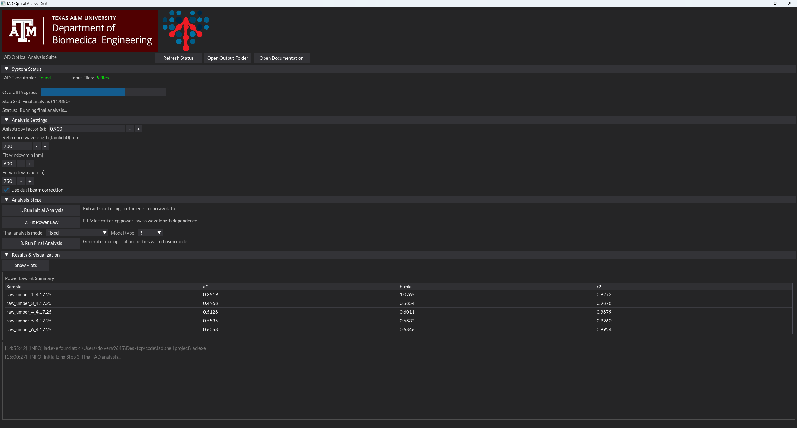

# IAD Optical Analysis Suite

A fully integrated desktop application for automating the **Inverse Adding-Doubling (IAD)** method used in optical property extraction of turbid media. Designed for biomedical optics researchers, this tool enables batch processing of reflectance and transmittance data with streamlined model fitting, simulation execution, and visualization.



---

## 🚀 Features

- 🖥️ Graphical User Interface (GUI) via DearPyGUI  
- 🧮 Automated execution of `iad.exe` for each wavelength/sample  
- 📂 Batch processing of `.rxt` files with scattering/absorption extraction  
- ⚙️ Supports fixed and power-law-based scattering modes  
- 📊 Real-time plotting and report generation  
- 🧠 Fits Mie-like power-law models:  
  <b>μs′(λ) = a₀ · (λ / λ₀)<sup>−b<sub>mie</sub></sup></b>
- 📁 Organized output directory with logs, plots, and CSV results  

---

## 📁 Folder Structure

```
iad_app/
├── core/               # Core logic and processing engine
├── docs/               # Documentation and screenshots (e.g. screenshot.png)
│   └── screenshot.png
├── gui/                # DearPyGUI or frontend modules
├── iad_inputs/         # Input .rxt files for IAD analysis
├── iad_outputs/        # Output files from IAD simulations
├── tests/              # Unit tests and validation tools
├── utils/              # Utility functions (file I/O, plotting, etc.)
├── config/             # User-defined configuration files
│   └── config.yaml
├── config_loader.py    # Loads and parses YAML configs
├── iad.exe             # External IAD engine binary
├── iad_shell.py        # Main application launcher
├── iad_shell.spec      # PyInstaller build config
├── iad_shell_library.py# Core processing and model logic
├── LICENSE             # Project license (MIT)
└── README.md           # Project overview and documentation
```

- `iad_inputs/`: Contains `.rxt` files for each sample  
- `iad_outputs/`: Stores IAD results, plots, and summaries  
- `config.yaml`: User settings (e.g., wavelength range, g-value)

---

## 🧠 Background: Inverse Adding-Doubling

The Inverse Adding-Doubling method solves the radiative transfer problem in reverse to determine the **absorption** ($\mu_a$) and **reduced scattering** ($\mu_s'$) coefficients of a sample using measured reflectance ($R$) and transmittance ($T$):

- **Input:** Measured %R, %T at each wavelength  
- **Constraints:** Index of refraction, thickness, anisotropy $g$  
- **Output:** Optical properties $(\mu_a, \mu_s')$ per wavelength  

📚 Reference: [Scott Prahl’s IAD theory](https://omlc.org/software/iad/)

---

## 📦 Installation

### ✅ Prerequisites

- Python 3.8+
- Windows (uses `iad.exe` binary)
- Optional: Git (to clone the repo)

---

### 🛠️ Run from Source (Python)

```bash
git clone https://github.com/dolvera9645/iad_app.git
cd iad_app
pip install -r requirements.txt
python iad_shell.py
```

---


## ⚙️ Usage Workflow

### 1. Initial Analysis
- Extracts raw scattering from `.rxt` files  
- Runs `iad.exe` in fixed mode with estimated $\mu_s'$

### 2. Scattering Model Fit
- Fits power-law model:  
  <b>μs′(λ) = a₀ · (λ / λ₀)<sup>−b<sub>mie</sub></sup></b>
 
- User selects wavelength fitting range (e.g., 600–750 nm)

### 3. Final Analysis
- Runs IAD again, using either:
  - **Fixed Scattering Mode** (manual μs′ values)
  - **Power Law Mode** (reconstructed μs′ from model fit)

### 4. Visualization
- Choose GUI or matplotlib output
- Plots saved as `.png` and CSV exports

---

## 🧪 Example Output

| Wavelength (nm) | μa (1/mm) | μs′ (1/mm) |
|-----------------|-----------|------------|
| 750             | 0.152     | 0.512      |
| 700             | 0.189     | 0.578      |
| ...             | ...       | ...        |

---

## 📝 Configuration (`config.yaml`)

```yaml
g_value: 0.8
use_dual_beam: true
reference_wavelength: 600
fit_range:
  min: 600
  max: 750
```

---

## 🧑‍💻 Developer Notes

- Modular architecture:
  - `iad_model.py` — optical model fitting and IAD prep
  - `iad_gui.py` — DearPyGUI frontend
  - `iad_core.py` — engine that calls `iad.exe'

---

## 📄 License

MIT License — feel free to use and modify.

---

## 🙋‍♂️ Author

**Diego Olvera**  
Biomedical Engineering @ Texas A&M  
GitHub: [@dolvera9645](https://github.com/dolvera9645)

---

## 🔗 References

- [Inverse Adding-Doubling Method](https://omlc.org/software/iad/)  
- [DearPyGUI](https://github.com/hoffstadt/DearPyGui)  
- [Scipy: `curve_fit`](https://docs.scipy.org/doc/scipy/reference/generated/scipy.optimize.curve_fit.html)
